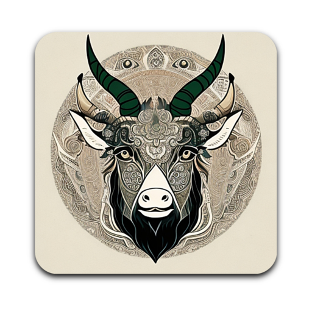
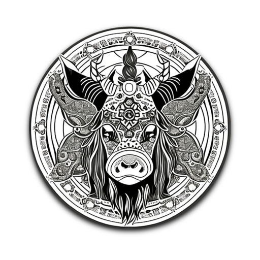
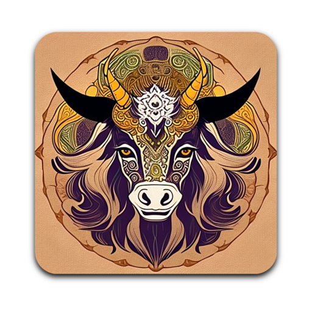
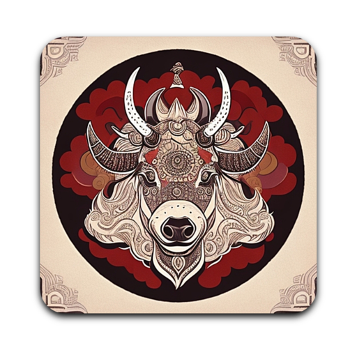
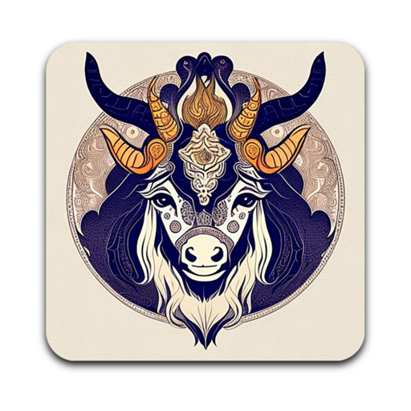
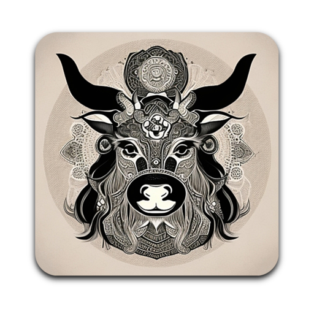

# Infinite Yak Icons

In the sprit of Gnu, furry animals, infinite customization and eternal yak shaving.

This is the Infinite Yak icons collection for Emacs.

# Icons...

### Infinity yakadacious


### Infinity yakakadabra


### Infinity yakalaka



### Infinity yakamoto


### Infinity yakandwhite


### Infinity yakinterstellar



### Infinity yakjourney


### Infinity yaksatori



### Infinity yakamura


### Infinity yaknoir


### Infinity yakonfire



### Infinity yakonthewater



### Infinity yaktopia




# Install

Git clone this repo / or download the .zip from github to install.

# Macos

.PNG originals and iconsets available here, along with macOS .icns files.

To use one, copy it to `Emacs.app/Content/Resources/Emacs.icns` and `touch
Emacs.app`. You will need to close Emacs, and update your Dock icon (drag it
from `/Applications/Emacs.app`) to see the change.

### Windows and Linux

Linux users can find all the relevant PNG icons in the `iconsets` folder.

Windows user can create `.ico` files with Imagemagick `convert`, pick the icon png / size you want. For example:

``` sh
convert iconsets/infinity-yak-alaka.iconset/icon_128x128.png  Emacs.ico
```

You will need to assign the `.ico` to your Emacs executable.

## Licence

GNU GPLv3.
