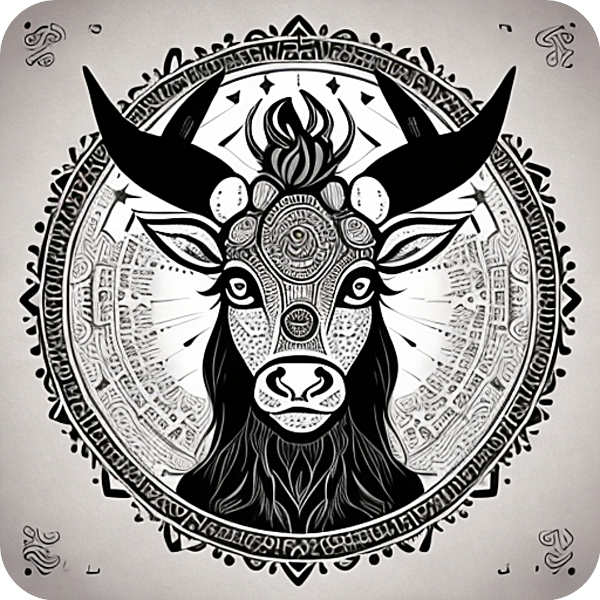

# Infinite Yak Icons

In the sprit of Gnu, furry animals, infinite customization and eternal yak shaving.

This is the Infinite Yak icons collection for Emacs.

Png originals and iconsets are provided along with macOS .icns files.

To use one, you can copy it to Emacs.app/Content/Resources/Emacs.icns and `touch Emacs.app`.  Finder may also need a re-launch.

Git clone this repo / or download the .zip from github to install.

Licence, GPLv3.

# Icons...

